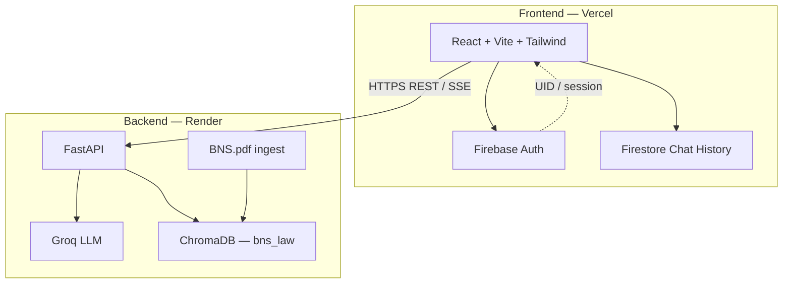

# Nyay Sahayak — AI Legal Assistant for India

> Instant BNS-grounded legal guidance, FIR support, IPC↔BNS mapping, and government service links — in **English**.


## Live Demo

| Surface | URL |
|--------|-----|
| **Frontend** | [nyay-sahayak-react-ui.vercel.app](https://nyay-sahayak-react-ui.vercel.app) |
| **Backend API docs** | [nyay-sahayak-api-i0so.onrender.com/docs](https://nyay-sahayak-api-i0so.onrender.com/docs) |

**Repository:** [github.com/knarendrakumar187/Nyay-Sahayak-react-UI](https://github.com/knarendrakumar187/Nyay-Sahayak-react-UI)

---

## Features

- **BNS Legal Chat (RAG)** — Answers grounded in Bharatiya Nyaya Sanhita via ChromaDB retrieval + Groq LLM
- **Role-based tools** — Citizen, Advocate, Police, and Student see different menus
- **File Report (FIR)** — Interactive FIR interview flow (**Police role only**)
- **IPC ↔ BNS Mapping** — Official NCRB correspondence lookup (IPC→BNS and BNS→IPC)
- **E-Legal Seva** — Curated government portals (e-Courts, cybercrime, RTI, DigiLocker, etc.)
- **Voice Assistant** — Speak questions and hear responses (English)
- **Document helpers** — Legal notice / related generation endpoints
- **Firebase Auth** — Email/password + Google sign-in; chat history in Firestore
- **Light / dark theme** — Dark default; profile settings for theme, role, detail level

### Role → tools

| Role | Ask / chat | FIR | IPC↔BNS map | Digital Seva |
|------|------------|-----|-------------|--------------|
| Citizen | Ask Legal Help | — | Yes | Citizen Seva |
| Advocate | Legal Research | — | Yes | Court & Seva Links |
| Police | Legal Assistant | **File Report (FIR)** | Yes | Official Portals |
| Student | Learn BNS | — | Yes | Explore Services |

Role can be changed anytime in **Profile Settings**.

---

## Architecture



### Request flow (legal chat)

1. User sends a question from the React app.
2. FastAPI retrieves relevant chunks from the **BNS** Chroma collection.
3. Context + question are sent to **Groq** (streaming response).
4. UI renders the stream; optional voice TTS plays the answer.
5. Chat turns can be saved to **Firestore** for the signed-in user.

### Data sources

| Data | Purpose |
|------|---------|
| `backend/data/BNS.pdf` | Official BNS text → chunked into ChromaDB (`bns_law`) |
| `frontend/src/data/ipcBnsMap.json` | NCRB Sankalan IPC↔BNS section table (~550 rows) |
| Firebase Auth / Firestore | Users, sessions, chat history |

---

## Tech Stack

### Frontend
- React 19 + Vite + TypeScript/JSX
- Tailwind CSS + Framer Motion
- React Router
- Firebase Auth & Firestore
- Hosted on **Vercel**

### Backend
- FastAPI + Uvicorn
- Groq (`langchain-groq` / Groq SDK)
- ChromaDB (local persistent store on the API host)
- pypdf / FPDF / python-docx
- Hosted on **Render** (`render.yaml`)

---

## Project Structure

```
Nyay-Sahayak-react-UI/
├── backend/
│   ├── api.py                 # FastAPI routes (chat, FIR, voice, docs)
│   ├── ingest.py              # BNS PDF → ChromaDB
│   ├── data/BNS.pdf           # Source statute PDF
│   ├── nyay_memory/           # Chroma persistence (gitignored)
│   ├── requirements.txt
│   └── Dockerfile
├── frontend/
│   ├── public/                # Static assets
│   ├── src/
│   │   ├── App.tsx            # Routes, auth, mode switching
│   │   ├── firebase.js
│   │   ├── components/        # Chat, Sidebar, Mapper, Boot, etc.
│   │   ├── pages/             # Home, Auth
│   │   ├── config/            # API base URL, roleAccess menus
│   │   ├── data/ipcBnsMap.json
│   │   └── hooks/             # Voice + legal AI helpers
│   ├── vercel.json
│   └── package.json
├── scripts/
│   └── build_ipc_bns_map.py   # Rebuild IPC↔BNS JSON from NCRB HTML
├── render.yaml                # Render service definition
└── README.md
```

---

## Backend API (overview)

| Method | Path | Description |
|--------|------|-------------|
| `POST` | `/stream-chat` | Streaming legal Q&A with BNS RAG |
| `POST` | `/file-report-interview` | FIR interview turn |
| `POST` | `/voice-message` | Speech → text → chat |
| `POST` | `/generate-legal-notice` | PDF legal notice |
| `POST` | `/generate-rent-agreement` | PDF rent agreement |
| `GET` | `/docs` | OpenAPI (Swagger) |

Interactive docs: `http://localhost:8000/docs` (local) or the live Render `/docs` URL above.

---

## Quick Start (Local)

### Prerequisites
- Node.js 18+
- Python 3.10+ (3.11 recommended)
- Groq API key — [console.groq.com](https://console.groq.com/)
- Firebase project (Auth Email/Password + Google; Firestore)

### 1. Clone

```bash
git clone https://github.com/knarendrakumar187/Nyay-Sahayak-react-UI.git
cd Nyay-Sahayak-react-UI
```

### 2. Backend

```bash
cd backend
python -m venv venv

# Windows
venv\Scripts\activate
# macOS / Linux
source venv/bin/activate

pip install -r requirements.txt

# Create backend/.env
# GROQ_API_KEY=your_key_here

# Ingest BNS into Chroma (first run / after PDF change)
python ingest.py

uvicorn api:app --reload --host 0.0.0.0 --port 8000
```

API: `http://127.0.0.1:8000`

### 3. Frontend

```bash
cd frontend
npm install

# Create frontend/.env
# VITE_API_URL=http://127.0.0.1:8000

npm run dev
```

App: `http://localhost:5173`

Configure Firebase in `frontend/src/firebase.js` (or env-based config if you extend it). Add `localhost` and your deploy domain under Firebase **Authentication → Authorized domains**.

---

## Environment Variables

### Backend (local / Render)

| Variable | Required | Description |
|----------|----------|-------------|
| `GROQ_API_KEY` | Yes | Groq API key |
| `PORT` | Auto on Render | Uvicorn bind port |

### Frontend (local / Vercel)

| Variable | Required | Description |
|----------|----------|-------------|
| `VITE_API_URL` | Yes in prod | Backend base URL (no trailing slash) |

---

## Deployment

### Backend — Render

`render.yaml` builds with:

```text
pip install -r requirements.txt && python ingest.py
```

and starts:

```text
uvicorn api:app --host 0.0.0.0 --port $PORT
```

1. Connect the GitHub repo in Render.
2. Set `GROQ_API_KEY` in the service environment.
3. Deploy; confirm `/docs` loads.

### Frontend — Vercel

1. Import the repo; **Root Directory** = `frontend`.
2. Framework: Vite.
3. Set `VITE_API_URL` to your Render API URL (e.g. `https://nyay-sahayak-api-i0so.onrender.com`).
4. Deploy; add the Vercel domain in Firebase authorized domains.

---

## Rebuild IPC ↔ BNS map (optional)

If you refresh the NCRB table HTML locally as `ncrb_raw.html` at the repo root:

```bash
python scripts/build_ipc_bns_map.py
```

Writes `frontend/src/data/ipcBnsMap.json`. Source reference: [NCRB Sankalan Section Table](https://www.ncrb.gov.in/uploads/SankalanPortal/SectionTableBNS.html).

Always verify critical section mappings against the bare Act / India Code before charging or filing.

---

## Security Notes

- Do **not** commit `.env` files or API keys.
- Restrict Firebase Auth domains to localhost + production hosts.
- Treat AI output as guidance, not a substitute for a licensed advocate.
- Chroma / `nyay_memory` is generated at build/runtime — keep it out of git.

---

## License

MIT

## Acknowledgments

- [Groq](https://groq.com/) — LLM inference  
- [Firebase](https://firebase.google.com/) — Auth & Firestore  
- [Render](https://render.com/) — API hosting  
- [Vercel](https://vercel.com/) — Frontend hosting  
- NCRB Sankalan — IPC / BNS correspondence reference  

---

<p align="center">
  Built for accessible justice in India
</p>
